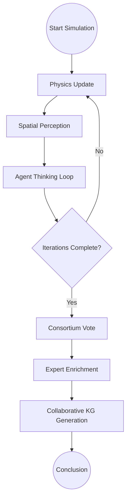

# Murmur Swarm 🌌

**Murmur Swarm** is a sophisticated multi-agent orchestration framework that blends **spatial physics** with **agentic cognition**. Inspired by the emergent behaviors of starlings (murmurations), this system enables a collective of specialized AI agents to interact in a 3D virtual space, influencing each other through proximity while collaboratively solving complex research problems.

---

## 🏗 System Architecture

The swarm is managed by a centralized **Orchestrator** powered by [LangGraph](https://github.com/langchain-ai/langgraph). The simulation follows a structured lifecycle where agents move, perceive, and think in iterative cycles.



---

## 🛸 Spatial Dynamics (Physics Engine)

The swarm isn't just a list of agents; it's a **dynamic topology**. Each agent occupies a position in 3D space, and their movement is governed by a modified **Boids Algorithm**:

1.  **Separation**: Prevent crowding by maintaining distance from neighbors.
2.  **Alignment**: Steer towards the average heading of local peers.
3.  **Cohesion**: Move towards the center of mass of local peers.
4.  **Goal Seeking**: A gentle pull towards the center of the problem space (0,0,0).

### The Influence Matrix
Proximity determines **Influence**. An agent only "hears" the thoughts of others within its `visual_range`. The Orchestrator maintains a real-time `influence_matrix` where scores decay quadratically with distance. This ensures that clusters of agents develop localized sub-narratives before they merge into a global consensus.

---

## 🧠 Cognitive Dynamics (Agent Thinking)

Each agent in the swarm is a specialized persona (e.g., Structural Engineer, Iconoclast, Synthesizer). Their cognitive process follows a **ReAct (Reason + Act)** pattern:

-   **Perception**: The agent retrieves the latest thoughts from its influential neighbors.
-   **Memory Retrieval**: It queries its local **Knowledge Graph (KG)** and **Long-Term Memory (LTM)** for domain-specific context relevant to the current discussion.
-   **Internal Thought**: The agent generates a new contribution, balancing the global goal with its specific domain expertise and the local peer context.

### Parallel Execution
The system supports both sequential and high-concurrency parallel execution of agent thoughts, respecting global rate limits (RPM/TPM) across different LLM providers (Gemini, NVIDIA, Ollama).

---

## 📝 Consensus & Synthesis

Once the spatial-cognitive loop completes, the swarm enters the **Synthesis Phase**:

1.  **Consortium Vote**: Agents aggregate their final positions. A lead model synthesizes these into a primary consensus.
2.  **Expert Enrichment**: Each agent performs a technical "pass" over the consensus, adding domain-specific addendums and methodology critiques without deleting others' work.
3.  **Collaborative Knowledge Graph**: The agents collaboratively build a structured JSON Knowledge Graph representing the final conclusion, which is then persisted for future simulations.

---

## 📂 Core Orchestration Files

| File | Responsibility |
| :--- | :--- |
| [`swarm_orchestrator.py`](file:///Users/mike/Documents/code/Murmur_swarm/swarm_orchestrator.py) | The "brain" of the system. Manages the LangGraph state machine and agent lifecycle. |
| [`swarm_physics.py`](file:///Users/mike/Documents/code/Murmur_swarm/swarm_physics.py) | Handles 3D vector math, Boids behaviors, and the Influence Matrix. |
| [`swarm_schema.py`](file:///Users/mike/Documents/code/Murmur_swarm/swarm_schema.py) | Defines the Pydantic data models for Snapshots, Agents, and Vectors. |
| [`knowledge_graph.py`](file:///Users/mike/Documents/code/Murmur_swarm/knowledge_graph.py) | Logic for RAG retrieval and collaborative graph construction. |
| [`swarm_io.py`](file:///Users/mike/Documents/code/Murmur_swarm/swarm_io.py) | Manages persistence for agent configs, snapshots, and conclusions. |

---

## 🚀 Getting Started

To launch the Swarm Intelligence Control Tower (Streamlit UI):

```bash
./.venv/bin/streamlit run app.py
```

All simulation data, including agent thoughts, exported JSONs, and final research papers, are stored in the [`swarm_data/`](file:///Users/mike/Documents/code/Murmur_swarm/swarm_data) directory.
